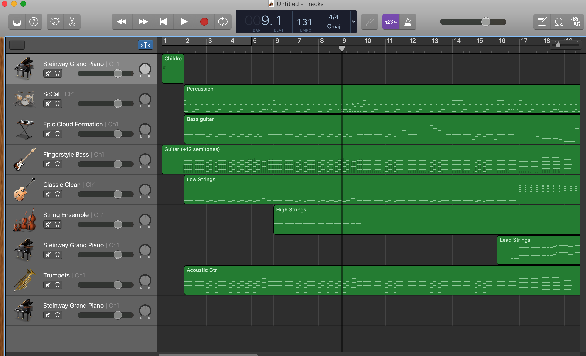

# Scale
**Scale** is a project I built when I was a Data Engineering Fellow at Insight Data Science. It focusses on analyzing the content of a song using MIDI files.

### Motivation
Everybody loves listening to new music. That has led to various kinds of Music Recommendation engines using different techniques like:
* **Collaborative Filtering**: based on user's listening behavior. This fails to recommend new and good songs.
* **Raw Audio Signal analysis**: Attempts to find good and new songs based on similar instruments. It's not a definitive analysis as same instruments could be present in 2 songs playing in different scale(pitch) and the analysis would fail to gauge the similarity.

These approaches fails to find equivalence that can readily gauged using MIDI files.

### Solution
I used MIDI files - a file format that was established in the 1980's. It's still a very popular file format now. It's used by musicians as it essentially is a digital version of music score. I used a dataset of MIDI files to find similar songs within that dataset.

## Solution
MIDI files to the rescue! They allow us to analyze music is the realm of music - as opposed to audio signal realm.

The richer musical traits that are available from MIDI files are:
* Notes
* Chords
* Key signature
* Rhythm
* Note progression
* Chord progression
* Time signature

## Tech Stack
* AWS S3
* Spark
* Flask

## Project Scope
### In scope
* Build a new method to analyze music
* Enables ML engineers to improve recommendation

### NOT in scope
* Figure out the best musical features to compare songs
  * Could be chord progression OR rhythm progression
  * It is purely a ML task
